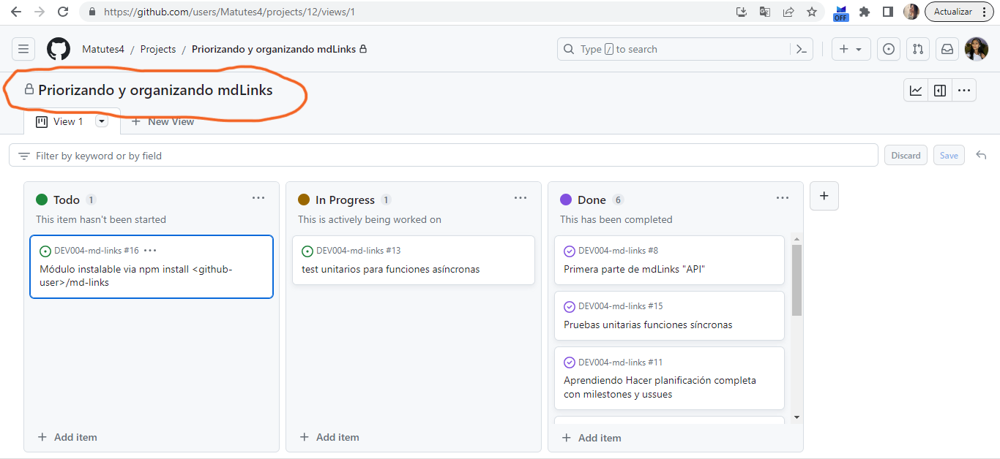
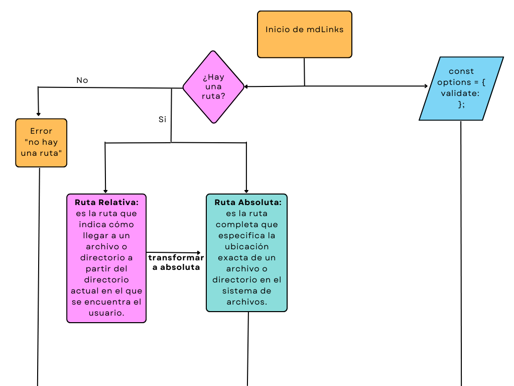
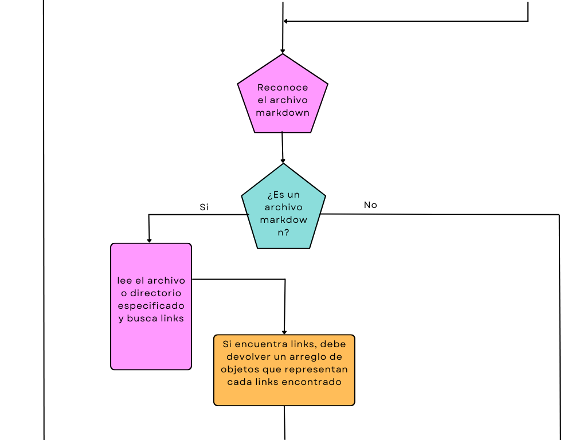
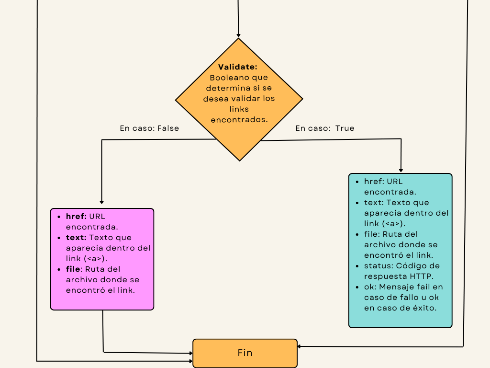
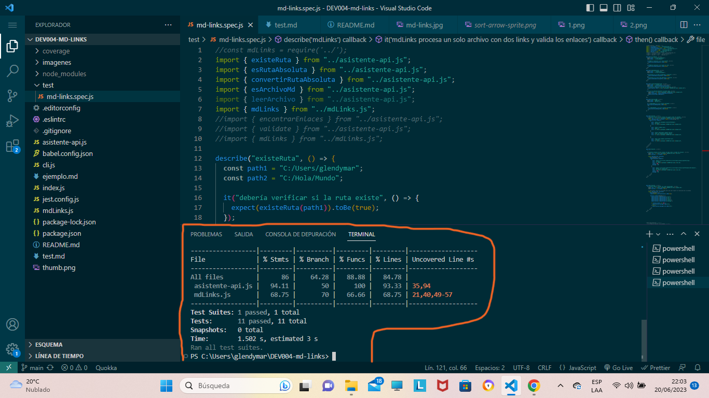

# Markdown Links

## Índice

* [1. Preámbulo](#1-preámbulo)
* [2. Descripción](#2-Descripción)
* [3. instalación](#3-instalación)
* [4. Planificación](#5-planificación)
* [5. Diagrama de flujo](#3-Diagrama-de-flujo)
* [6. pruebas unitarias](#7-pruebas-unitarias)
* [7. Archivos del proyecto](#9-Archivos-del-proyecto)
* [8. Este proyecto consta de dos partes](#10-Este-proyecto-consta-de-dos-partes)

***

## 1. Preámbulo

[Markdown](https://es.wikipedia.org/wiki/Markdown) es un lenguaje de marcado
ligero muy popular entre developers. Es usado en muchísimas plataformas que
manejan texto plano (GitHub, foros, blogs, ...) y es muy común
encontrar varios archivos en ese formato en cualquier tipo de repositorio
(empezando por el tradicional `README.md`).

Estos archivos `Markdown` normalmente contienen _links_ (vínculos/ligas) que
muchas veces están rotos o ya no son válidos y eso perjudica mucho el valor de
la información que se quiere compartir. 

Dentro de una comunidad de código abierto, nos han propuesto crear una
herramienta usando [Node.js](https://nodejs.org/), que lea y analice archivos
en formato `Markdown`, para verificar los links que contengan y reportar
algunas estadísticas. Por ejemplo en Laboratoria podrían usar esta 
herramienta para detectar los links rotos en los readmes de los proyectos
o en un área de facturación verificar los links rotos de una factura dígital.


## 2. Descripción
md-links es una potente herramienta de línea de comandos (CLI) que analiza tus archivos Markdown en busca de enlaces. Su función principal es verificar la validez de estos enlaces, es decir, comprobar si los enlaces están activos y funcionan correctamente. De esta manera, te ayuda a identificar y corregir enlaces rotos o incorrectos en tus documentos Markdown.
 
 En resumen es una herramienta que te ayuda a mantener el control de los enlaces en tus archivos Markdown, verificando su validez y brindándote información relevante para mejorar la calidad de tus documentos y proyectos.

 ## 3. instalación 

 Antes de comenzar a utilizar Md-links, necesitarás instalarlo en tu entorno de desarrollo. Sigue los pasos a continuación para completar la instalación:

Abre tu terminal o línea de comandos. Ejecuta el siguiente comando para instalar Md-links:

npm i glendy-md-links

 ## 4. Planificación
  

 ## 5. Diagrama de flujo
 
 
 

 ## 6. Pruebas Unitarias
 


 ## 7. Archivos del proyecto
 
 * `README.md` con descripción del módulo, instrucciones de instalación/uso,
  documentación del API y ejemplos. Todo lo relevante para que cualquier
  developer que quiera usar tu librería pueda hacerlo sin inconvenientes.
* `index.js`: Desde este archivo debes exportar **una** función (`mdLinks`).
* `package.json` con nombre, versión, descripción, autores, licencia,
  dependencias, scripts (pretest, test, ...), main, bin
* `.editorconfig` con configuración para editores de texto. Este archivo no se
  debe cambiar.
* `.eslintrc` con configuración para linter. Este archivo contiene una
  configuración básica para ESLint, si deseas agregar reglas adicionales
  como Airbnb deberás modificar este archivo.
* `.gitignore` para ignorar `node_modules` u otras carpetas que no deban
  incluirse en control de versiones (`git`).
* `test/md-links.spec.js` debe contener los tests unitarios para la función
  `mdLinks()`. Tu inplementación debe pasar estos tets.

 
 ## 8. Este proyecto consta de dos partes

 
### 1) JavaScript API

El módulo debe poder **importarse** en otros scripts de Node.js y debe ofrecer la
siguiente interfaz:

#### `mdLinks(path, options)`

##### Argumentos

* `path`: Ruta **absoluta** o **relativa** al **archivo** o **directorio**.
Si la ruta pasada es relativa, debe resolverse como relativa al directorio
desde donde se invoca node - _current working directory_).
* `options`: Un objeto con **únicamente** la siguiente propiedad:
  - `validate`: Booleano que determina si se desea validar los links
    encontrados.

##### Valor de retorno

La función debe **retornar una promesa** (`Promise`) que **resuelva a un arreglo**
(`Array`) de objetos (`Object`), donde cada objeto representa un link y contiene
las siguientes propiedades

Con `validate:false` :

* `href`: URL encontrada.
* `text`: Texto que aparecía dentro del link (`<a>`).
* `file`: Ruta del archivo donde se encontró el link.

Con `validate:true` :

* `href`: URL encontrada.
* `text`: Texto que aparecía dentro del link (`<a>`).
* `file`: Ruta del archivo donde se encontró el link.
* `status`: Código de respuesta HTTP.
* `ok`: Mensaje `fail` en caso de fallo u `ok` en caso de éxito.

#### Ejemplo (resultados como comentarios)

```js
const mdLinks = require("md-links");

mdLinks("./some/example.md")
  .then(links => {
    // => [{ href, text, file }, ...]
  })
  .catch(console.error);

mdLinks("./some/example.md", { validate: true })
  .then(links => {
    // => [{ href, text, file, status, ok }, ...]
  })
  .catch(console.error);

mdLinks("./some/dir")
  .then(links => {
    // => [{ href, text, file }, ...]
  })
  .catch(console.error);
```

### 2) CLI (Command Line Interface - Interfaz de Línea de Comando)

El ejecutable de nuestra aplicación debe poder ejecutarse de la siguiente
manera a través de la **terminal**:

`md-links <path-to-file> [options]`

Por ejemplo:

```sh
$ md-links ./some/example.md
./some/example.md http://algo.com/2/3/ Link a algo
./some/example.md https://otra-cosa.net/algun-doc.html algún doc
./some/example.md http://google.com/ Google
```

El comportamiento por defecto no debe validar si las URLs responden ok o no,
solo debe identificar el archivo markdown (a partir de la ruta que recibe como
argumento), analizar el archivo Markdown e imprimir los links que vaya
encontrando, junto con la ruta del archivo donde aparece y el texto
que hay dentro del link (truncado a 50 caracteres).

#### Options

##### `--validate`

Si pasamos la opción `--validate`, el módulo debe hacer una petición HTTP para
averiguar si el link funciona o no. Si el link resulta en una redirección a una
URL que responde ok, entonces consideraremos el link como ok.

Por ejemplo:

```sh
$ md-links ./some/example.md --validate
./some/example.md http://algo.com/2/3/ ok 200 Link a algo
./some/example.md https://otra-cosa.net/algun-doc.html fail 404 algún doc
./some/example.md http://google.com/ ok 301 Google
```

Vemos que el _output_ en este caso incluye la palabra `ok` o `fail` después de
la URL, así como el status de la respuesta recibida a la petición HTTP a dicha
URL.

##### `--stats`

Si pasamos la opción `--stats` el output (salida) será un texto con estadísticas
básicas sobre los links.

```sh
$ md-links ./some/example.md --stats
Total: 3
Unique: 3
```

También podemos combinar `--stats` y `--validate` para obtener estadísticas que
necesiten de los resultados de la validación.

```sh
$ md-links ./some/example.md --stats --validate
Total: 3
Unique: 3
Broken: 1
```

 

 
